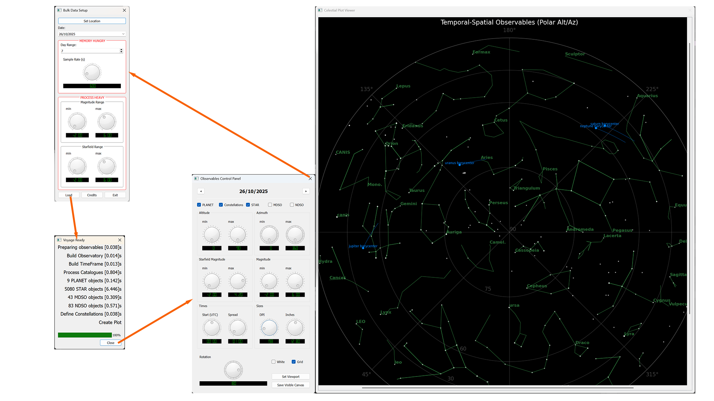

# ALMANAC - a sky exploration app

## Using the Almanac

_(1, 0)world:astrophotography.almanac_

The almanac is a means to explore the positions of celestial objects from any given vantage point (on earth). By building the almanac I became much more familiar with the night sky above my back garden, and I hope it could be  a good familiarisation tool for others just starting out in astronomy or astrophotography. Seasoned astronomers might well sccoff at its simple premise, but for me just being able to visualise which way everything moves and how far things move in a minute or an hour, or day by day, was really helpful. Seeing when the sun and the moon transit together, or else are in opposition, is helpful for planning night sky shoots. Observing just when Orion does, or does not, rise above the bushes at the end of my garden, actually quite thrilling (I love Orion, so easy to spot when he's around).

The software operates in 2 main stages:

- Setting up the bulk data so that the sky can be drawn

- Manipulating the drawn plot to explore how things move over time

The first stage takes significant time and memory. On my 36-core workstation plotting everything down to a magnitude of 18 across a full lunar cycle takes just over 1 minute and consumes 8GB of RAM. More conservative settings, say a week's worth of data down to a magnitude of 6, takes around 10 seconds using 2GB of RAM. The second sttage, off exploring the pplot, all happens pretty fast so one can rotate, drag, zoom and filter the plotted data interactively.

Note that setting longer time ranges for the plot increases the memory required, but has little impact on the bulk data processing time (thanks to the magic of skyfield's time-vectored calculations). Requesting more observations (i.e. extending the magnitude range of the plotable objects) increases the processing cost (because skyfield does not vectorise multiple targets). That said, if you are interested in faint objects, you can limit upper range, e.g. plot only magnitudes between 6 and 18 to filter out the brightest objects. It all just depeneds on what you want to explore, and how good your PC is!

The data plotted comes from several sources (see the 'credits'). The sun moon and planetary positions are provided by skyfield. The starfield it self from Vizier's V50 catalogue. Deep sky objects are taken from the famous Messier catalogue and from the NGC 2000 catalogue; so that's quite comprehensive. The raw data is found in CSV files in the 'catalogues' sub-directory of the script's working directory. You can readily add more catalogues here, but you would need to link them in by modifying the *observations.py* script. If you do, you _should_ see the new catalogue automagically apppears in the plot, with a checckbox to turn it on and off..! Well I hope, I tried to make the thing extensible. Note that this observations script makes use of *catalogue.py* to process CSV files, which is quite flexible regards the nature of the data in the catalogue (e.g. ascensions can be in degrees, sexagesimal or hour angles) and the required column headers. It doesn't account for any kind of comment lines in a CSV file (such as one gets when downloading from Vizier) - so those need manually stripping-out...

Having gone to much trouble to make this little app, I couldn't resist also adding the constellation stick-figures. Constellations really help me navigate the night sky so seeing them was quite a boon. I used Marc van der Sluy's data for this (again, see the 'credits'), so thanks Marc. 

INSTALLATION

The app is a set of Python 3.12 scripts, you will also need to install the following packages:

    pip install numpy==2.1.3 skyfield==1.53 PyQt5==5.15.11 pandas==2.2.3 matplotlib==3.10.3 astropy==7.1.0

It might all work with later versions, but the above reflects the development environment.

Don't forget that the skyfield ephemeris files and the CSV catalogues are also required (in the sub-directoty *catalogues*)!

### App Dialogues

#### Set-up

_(280, 0)affordance:almanac\_ui.BulkDataControlPanel_

When the app starts it first presents the BulkDataControlPanel.

This is where the available data for the plot is limited to the range of interest, based on the power of the machine in-use (processor cores and RAM available), what exactly you want to explore, and the patience of the astronomer - i.e. how long you are prepared to wait for the plot! Which can be several seconds to a minute or more.

The things to be provided are:

- Location, the earth-bound vantage point of the astronomer, as a lat/lon pair

- The date of interest, between 1900 and 2050

- The number of days to be calculated (more days requires more RAM)

- The sample rate (seconds) for the calculations. 

- The range of magnitudes to be plotted, both for the deep sky objects and for the overall starfield.

The code is using starfiled's *de421.bsp* ephemeris data file (stored in the *catalogues* sub-directory). *de440s.bsp* is also included in that directory so you can switch to the bigger dataset (1550 to 2650) if you like - you'll need to change the literal file references (2 of) in *observations.py* and *observe.py* to do so.

The celestial positions can be stepped, initially, from noon on the given date by the sample rate. More samples (a lower sample rate) requires more memory (but not much more processing time); so one can see how far things move in a given time-step. This is especially useful to astrophotographers who can therefore determine how long a given object will remain in-frame for a given positioning of the optic.

The catalogues typically contain magnitudes from -1.46 down to 18, but calculating every entry takes time. So the data made available to the plot can be restricted at this point.

The BulkDataControlPanel also allows the *credits* to be reviewed - so you can see where I got all the data from.

Once the limits of the processing has been set, the *load* button performs the calculations. A progress view shows what is being ccalculated, how much of it there is and how long the calculations took. If its all just too slow, you can use more conservative settings next time! The progress view has to be manually closed, so you have chance to see the processing stats. Once closed, the plot it self is revealed.

#### Explore

_(51, 0)affordance:almanac\_ui.QueryControlPanel_

Once the plot is available it is shown in its own window and the QueryControlPanel opens up; this provides the controls for exploring the plot.

Initially all the celestial objects are plotted in their positions at UTC Noon on the requested start date. 

One can step through the days (as per the number of days requested) using the *left* and *right* buttons either side of the displayed *date* at the top of the panel.

The position of the objects at different times on the selected date can be seen by adjusting the UTC *Start* in the *Times* group. This dial steps as per the requested sample rate - e.g. will have 144 steps per day for a sample rate of 600 seconds.

Also in the *Times* group there is a *spread* control. This draws transit arcs, of the length set by the dial, showing how far things will move in the selected timeframe. It only applies to the sun, moon, planets and the deep sky objects (of the Messier and NGC catalogues) - i.e. not for the constellations nor for the starfield itself. If the spread is set to zero there is no arc shown, and the name annotations are removed - so you can get a nice clear view of the sky itself.

To get the clearest view of what you're interested in, you can refine the plotted data using the *Altitude*, *Azimuth*, and *Magnitude*s dials. Each has a min and max setting, the range being defined by the range of calculations you asked for in the *BulkDataControlPanel*. To further aid clarity of the view, you can use the toggles (near the top of the panel) to turn sets of data on or off: The Planets, The Starfield, The constellations, The Messier objects and / or the NGC objects. Turn them all off if you want, but then you don't see nothing!

At the bottom of the panel there is a *rotation* dial. This defaults to placing south at the top of the plot. That's because my garden faces south, so it's easy for me to relate what I see on screen to what I see out of my window... you of course can rotate the plot to match your own viewing aspect.

Next to the *rotation* dial are a set of controls designed to help in creating image files from the plot. You can switch from a black background to a white background (saving ink if printing plot images) and also turn the grid on or off.

The *Set Viewport* button helps to size the plot to given pixel dimensions and aspect ratios, which you probably want to do before selecting *Save Visible Canvas* to create a *png file* of the current visible plot area.

Before saving the image you can click-drag the canvas to get the area of interest into the visible window. There are then 2 controls to manage the 'zoomification'... I know, kinda awkward, why not just have a single zoom??? Well, using 2 dials (*DPI* and *Inches* in the *Sizes* group) marries well with how the underlying plot engine (matplotlib) works, but more importantly means you can independently control the size of the annotating texts and the zoom factor of the plot it self. Otherwise we can find the annotations are just too big when zooming in. Both controls change the size of the plot, but *DPI* also effects the relative text size. Thing to do is to get the plot about right with the *Inches* control, then gently juggle the 2 controls in opposite directions until the plot size and text size both feel good. To be honest, it *is* a bit complex, we could do with a moore natural *text size*, *plot zoom* control pair - but in practice once you know the settings that work best for you it's rare to really need to juggle these.

Once the exploration is done with, close the control panel (with the top-right X) to return to the *BulkDataControlPanel*. This closes the plot window as well.

Oh, and once you are back at the *BulkDataControlPanel*, you can get out of the app with the *exit* button (or with the top-right X)

### Burnt-in Defaults

_(22, 0)knowledge:almanac\_ui.AppState_: This is where all the defaults get stored - you can edit this script if you like to make the app less annoying everytime you start it if the defaults don't work for you.

The most likely changes you might want to make here are:

- qloc: query location, your home vantage lat/lon

- qsize: default DPI and Inches settings

- rotation: what gets put at the top of the plot. Polar plots default to 0deg at the left, so a value of 90 here places North at the top (my default is 270, to place South at the top)

---

---

## About the source code

_(142, 0)throughline:almanac_

The main process runs until we explicitly EXIT the BulkDataControlPanel.

We initially present the BulkDataControlPanel alllowing the user to constrain the memory and time requirements of the exploration.

When the user presses the LOAD button we step through all the data preparations, using the DawnTreader to display progress

Once the data has been prepared we launch the QueryControlPanel to allow the exploration.

When the QueryControlPanel is closed we return to the BulkDataControlPanel

-  Create the skyfield ephemeris and observation vantage

- Create the skyfield timescale timeseries
- Load the targets from the various catalogues, filtered by magnitude etc
- Make the positional calculations for all targets across the timeseries
- Prepare the constellations data
- create the plot

_(1, 0)throughline:timeframes_

Kind of a simple wrapper for skyfield timescale handling.

Provides an array of timepoints to be used when performing positional calcs based on the requested date range and sample rate.

Also creates a mask for that array of timepoints for given days, or parts of days.

_(1, 0)throughline:catalogue_

This module handles astronomical data sets in CSV files from variuos places. 

It uses pandas to load CSV files then adds internal columns (prefixed by double underscore) containing normalised data.

We create one catalogue object for each CSV file source.

This module also allows us to create a catalogue of constellations. These are obviously plotted differently to real sky objects, and so is a completely different kind of catalogue.

_(1, 0)throughline:observations_

This module resolves the full (fixed) set of catalogues and provides the mechanism for performing the positional calculations for every plotted sky object.

It IS readilly extensible and flexible, but I didn't build a UI for selecting catalogues, so will need editing to change source data (#sorrynotsorry)

_(1, 0)throughline:almanac\_ui_

This module holds the main UI for the app, and thus the shared internal app state.

It provides 2 dialogue panels.

The first establishes the bulk data for the plot exploration, i.e. the range of magnitudes to be provided and the days across which to make the observations. It determines how much data can be explored, and thus how long it takes to prepare the plot for observation.

The second provides exploratory controls that are near instantaneous in response. E.g. filtering the displayed magnitudes, selecting a day, rotating/scaling the view etc...

_(1, 0)throughline:base\_ui_

This module offers a collection of support classes that refine PyQt to our specific needs.

These classes either regularise the UI behaviour, or else just make PyQt easier to work with.

_(1, 0)throughline:screen\_ui_

This module provides all the screen based UI primitives.

It is tightly bound to the PyQT and matplotlib libraries.

It provides entry points for UI features that allow the viewport to be sized and saved.

It manages the main plot display window, adding canvas dragability and viewpoort resize behaviours

_(1, 0)throughline:plotter_

This module presents the plot in an independant window.

It provides methods to operate the display from the QueryControlPanel.

When it comes to plottting, the entire plot is remade for every change that is requested. Suprisingly this is quite fast enough. I *could* have created line collections etc that get updated on change (rather than recreating all plot elements every time) - but that is much more complex and as I've said, this is all actually fast enough. Unless on your PC it isn't!

---

---

## Script Modules

### Calculations and Data

#### Timeframes

_(18, 0)affordance:timeframes.TimeFrame_

Provides a skyfield compatable time series based on date range and sample rate.

Creates masks for that series as needed.

_(58, 4)skill:timeframes.TimeFrame.sample\_window_: Provides a mask for the time  series for when we want to calculate specific positions

_(43, 4)skill:timeframes.TimeFrame.\_get\_time\_series_: Creates the timescale object that later allows time-batched observations to be calculated

_(35, 4)skill:timeframes.TimeFrame.\_utc\_anchor_: Creates a UTC datetime object to tether the timescale

_(10, 0)continuum:timeframes.datetime_: We use native datetime objects to construct the date range of interest as an input to the timescale linspace method

_(7, 0)continuum:timeframes.numpy_: We use numpy to create boolean mask arrays

_(15, 0)continuum:timeframes.skyfield.api_: The skyfield Loader provides the timescale object

_(12, 0)continuum:timeframes.zoneinfo_: We work soley in UTC

#### Catalogues

_(29, 0)affordance:catalogue.Catalogue_

Here we provide a pandas' dataframe that has (likely) been loaded from CSV file. 

We nominate the columns that contain the needful information and (where needed) the format in which that information has been provided.

We also perform a first-level taming of the data, since we are dealing with many thousands of sky objects. Rows with no magnitude value are completely droppped, and then further filtered by the range of magnitudes the user has asked for.

-  Pre-check: If we already have all the columns we work with then nothing more to do

- Pre-check: if we are to convert co-ords, make sure we can create the intermediate columns we will need
- Normalize name column, using row indices as the name if there is no source name column
- Pre-check all provided column names exist
- Normalize magnitude column, drop blanks and filter by required range. Keep the original magnitudes but also create a norm_mag column such that min magnitudes are zero and max magnitudes are 1.0
- Use the norm_mag values to derive columns for plot size and colour relative to magnitude
- drop rows where other columns contain poor data
- If necessary split the combined RA/Dec column
- Process RA/Dec from provided format to degrees
- Construct SkyCoord now that both RA and Dec are known
- add a column that identiifies the source type of the catalogue
- Create column for RA in hours

_(177, 4)skill:catalogue.Catalogue.\_precheck\_derived\_cols_: If some, but not all, of our internal working columns already exist in the CSV then we can't entirely trust the source so we raise an error.

Otherwise we return a boolean that indicates either all of our derived columns already exist (and we can use them) or none of our derived columns already exist (so we can create them).

_(189, 4)skill:catalogue.Catalogue.\_precheck\_source\_cols_: A simple check that one or more source colummns exists in the dataframe

_(119, 4)mechanism:catalogue.Catalogue.\_raw\_type\_check_: First, it is a nonsense to say that Declination is specified in HOURS, so we guard against that userccode error

Then, if we are to convert from sexagesimal we have to ensure the intermediate column does not already exist

_(168, 4)skill:catalogue.Catalogue.\_rename\_col_: Renames a source column to our standard (internal) name, if needs be

_(132, 4)mechanism:catalogue.Catalogue.\_cleanse\_nan_: Removes rows where the column contains non-numerics (if it is a numeric, not string column) and rows where the column value is empty (numeric or string)

_(143, 4)mechanism:catalogue.Catalogue.\_col\_splitter_: Specifically for the case where RA/Dec are provided as a string in a single column

If we specify the same column for 2 of the needed columns (specifically RA/Dec) then we need to split the column.

We can only do so if the required intermediate colummns do not already exist.

If we cannot split into exactly 2 columns we raise an error.

Otherwise we return the names of the split (intermediate) columns that we created.

_(204, 4)mechanism:catalogue.Catalogue.\_process\_skypos_: Performms the RA/Dec conversions from source type to DEGREES

Catering for multicolumn definition when source type is SEXAGESIMAL

#### Constellations

_(229, 0)affordance:catalogue.Constellations_

This is kind of very specific but that's the nature of the source data.

We have a CSV file that identifies stars from the V50 catalogue that make up each of the (88) constellations.

We use this with the V50 catalogue to create a set of line segment definitioons for each constellation.

-  Load and clean constellation lines

- Strip whitespace from all string columns
- Forward fill constellation names for cases where we need multiple line collections to draw a constellation (i.e. pen has to come off the page to draw it)
- Add a sequence ID based on original row order, for when a constellation has more than 1 sequencce of points to plot (multiple lines)
- Melt (like a pivot) so we get 1 row per star ident instead of 31 star idents per row
- Clean Harvard Reference (HR) values, dropping rows where there is no HR star ident (i.e. we didn't need all 30 possible idents to draw this line)
- Identify missing HRs
- Final dataframe: constellation (abbreviation and line number), sequence, HR - which can later be converted to plottable lines once we have done the observations and know the positions of the referenced stars

_(270, 4)mechanism:catalogue.Constellations.get\_visible\_segments\_and\_labels_: Given the current positions of Harvard References create the plotable line segments using the constellation data

_(20, 0)knowledge:catalogue.RawType_: The different ways in which a CSV file may present co-ord data. I.e. As DEGREES, in SEXAGESIMAL format or as HOURANGLEs

_(16, 0)continuum:catalogue.astropy.coordinates_: Astropy converts various co-ord representations into degrees

_(9, 0)continuum:catalogue.enum_: We create an enum for the types of co-ords we might have to handle

_(11, 0)continuum:catalogue.numpy_: We use a little bit of numpy to help convert magnitudes into display brightness values

_(13, 0)continuum:catalogue.pandas_: Pandas is our main processing library as we are handling CSV files

#### Observations

_(24, 0)affordance:observations.Observatory_

Loads the skyfield ephemeris data (de421.bsp from the *catalogues* sub-directory) and creates the observation vantage point

_(37, 0)affordance:observations.Observables_

Creates a 'viewer' for each of the disk-bound CSV catalogues.

A viewer is the full set of catalogue data (name, RA/Dec degrees, magnitudes etc..) and decor that allows the catalogued objects' positions to be calculated and plotted.

We work with a fixed set of catalogues. I could have built a UI to select the catalogues of interest, but I didn't. This is easy to extend though.

The CSV heavy lifting is done by the general purpose *catalogue* module, here we apply it to each of our provisioned catalogues.

_(70, 4)mechanism:observations.Observables.catalogue\_planets_: We do not have a CSV file for the planets, sun and moon - their data comes from the ephemeris. BUT to keep things aligned downstream we deal with these in like manner to the other catalogues. I.e. we create a small dataframe that looks like it came from a catalogue CSV file.

_(146, 4)mechanism:observations.Observables.catalogue\_v50_: V50 is the bright star catalogue (Hoffleit & Warrenm 1991) we use it to draw the starfield and the constellations

_(163, 4)mechanism:observations.Observables.catalogue\_messier_: Messier is the deep-sky object catalogue (Messier 1781) we use it to plot nebulae, clusters, and galaxies

_(179, 4)mechanism:observations.Observables.catalogue\_ngc2000_: NGC2000 is the extended deep-sky catalogue (Sinnott 1988) we use it to plot nebulae, clusters, and galaxies beyond the Messier set

_(45, 4)knowledge:observations.Observables.num\_viewers_: We declare how many catalogues we have, so the external UI can create itself before we actually resolve eveything. I don't like having to do this statically but since the whole module statically defines the catalogue set it is not wholly inapparopriate!

_(8, 0)continuum:observations.numpy_: We use numpy just to create small colour arrays

_(10, 0)continuum:observations.pandas_: Source data is in CSVs, so we process with Pandas

_(13, 0)continuum:observations.skyfield.api_: We use the skyfield api to perform the time-batched positional calcs fromm a given vantage

_(18, 0)continuum:observations.skyfield.data_: We did use hipparcos to draw the starfield, but the constellations data references V50 (Harvard References) which does not directly correlate to the hipparccos data set - so we now draw the starfield using V50; but I have kept hipparcos as a reference of how we used to live...

_(6, 0)continuum:observations.time_: Catalogue proccessing can take time (we have thousands of sky objects) so we will report the processing time on a per catalogue basis

---

_(64, 0)affordance:observe.Observe_

This is the main process object that provides calculated positions of the targets.

Having done so it then provides methods for filtering (by time window) and masking (by AltAz or magnitude)

_(91, 4)skill:observe.Observe.observations_: Splits a catalogue of targets into chunks and dispatches the positional calculations across cores.

Small catalogues are executed immediately in the main process.

_(131, 4)skill:observe.Observe.get\_altaz\_window\_for\_all_: Filters the calculated positions by a given time range (which is a timeseries mask we got from the timeframes module) - this reduces the amount of data we then have to process when applying any other filters or transforms (rotations etc)

_(139, 4)skill:observe.Observe.get\_positional\_mask_: Creates an AltAz range limited positional mask for the time_mask filtered trajectories.

Here we mask rather than filter since the query is discontiguous (unlike time filtering, which is always a contiguous block of sample points)

_(162, 4)skill:observe.Observe.get\_magnitude\_mask_: Creates a Magnitude range limited mask for the time_mask filtered trajectories.

Here, again, we mask rather than filter since the query is discontiguous

_(49, 0)skill:observe.chunk\_dataframe_: A helper method that simply yields a chunk of catalogue targets

_(57, 0)skill:observe.unpack\_and\_compute_: A helper method that wraps the call to the compute method so the process mapper can dispatch the batches - we need this because pool.map expeccts a single argument for the mapped method invocation.

_(8, 0)continuum:observe.numpy_: as far as we can we use numpy vectorisation in all our calcs

_(4, 0)continuum:observe.os_: we refer the os library just to get the cpu count so we can constrain the multiprocessing batch size

_(14, 0)continuum:observe.Loader_: Because we are using multiprocessing this module has to be pickleable, so we cannot share the loaded ephemeris, each process has too load it for itself. Ugh. We do still benefit from the multiprocessing though...

_(17, 0)continuum:observe.Star_: We use skyfield's Star method to define observation targets. Note we are only using RA/Dec, Star can accept proper motion type data also (and some catalogues provide that) but since we are only creating a sky explorer that level of accuracy is not needed...

_(6, 0)continuum:observe.time_: Because this is the heavy lifting we use the time library to report how long things take

_(10, 0)continuum:observe.concurrent.futures_: Skyfield does a great job of vectorising our timepoint series (of hundreds of samples), but only on a per target basis. Since we have thousands of targets we use multiprocessing to batch them up

---

---

### Underlying UI

#### Base UI

_(64, 0)mechanism:base\_ui.DialControl_: Adds a numerical display to a dial control.

Therefore also manages how a dial control's range maps to application concepts (so that the displayed value makes sense to the application and user).

Dials are inherently integer based, but the values we are setting may be integers, floats, or sexagesimals (hours and minutes).

Conversion from dial integers to meaningful values is provided via the scale and offset parameters.

Our dial also allows for an on_change callback, which effectively decouples the dial from the application object it affects. Note this is only used / needed for singular dials, when we have an uber-control (e.g. a dial pair) it provides the callback.

_(190, 0)affordance:base\_ui.LocationEntryDialog_

Provides a dialogue that allows the lat/long of the observation vantage point to be provided.

Would be sweet to update this to a map picker, but that's madly complex!

Allows the GDPR sensitive "this is where I am" information to be encapsulated and hidden from the general UI view

_(133, 4)mechanism:base\_ui.DialControl.get\_value_: retrieves the raw (integer) value of the dial

_(137, 4)mechanism:base\_ui.DialControl.set\_value_: sets the raw (integer) value of the dial

_(141, 4)mechanism:base\_ui.DialControl.display\_value_: displays the scaled dial value

_(155, 4)mechanism:base\_ui.DialControl.get\_scaled\_value_: retrieves the scaled dial value

_(124, 8)behaviour:base\_ui.DialControl.\_reset\_dial.\_update_: Links the dial value to the numeric display value. Also invokes any callback, linking the dial value to the app state

_(116, 4)behaviour:base\_ui.DialControl.\_reset\_dial_: Links the dial value to the numeric display's double-click event

_(54, 0)mechanism:base\_ui.ClickableLCD_: Wraps the QLCDNumber widget so that mouse events can by caught and signalled. Let's us reset a control when its associated number display is double clicked

_(160, 0)mechanism:base\_ui.DialPairControl_: Presents a pair of (related) dials (e.g. define min/max of an app concept)

Provides for an on_change callback that gets invoked when either dial of the pair is changed.

_(14, 0)mechanism:base\_ui.UIBuilder_: Although PyQt presents rather nicely, I find juggling the layouts damned awkward. Layouts give rise to a lot of fragile code that just intereferes with the details when we create UI objects.

So as a simplification I create UI layouts such that each container flips the orientation of its parent - i.e. vertical blocks live inside horizontal blocks that live inside vertical blocks, etc...

Once the usercode has created all of its fundamental widgets, it arranges them in a recursive dict, which is then used to direct the actual horizontal and vertical layouts.

E.g. 

        ui_struct['dates']['left']  = self.left_btn

        ui_struct['dates']['date']  = self.date_label

        ui_struct['dates']['right'] = self.right_btn

        ui_struct['dials']['left']['alt']  = altitude_control

        ui_struct['dials']['right']['az']  = azimuth_control

Creates 2 vertical groups: dates and dials. The dates group contains 3 horizontal widgets (left, date, right). The dials group contains 2 horizontal widgets (alt and az)

_(6, 0)continuum:base\_ui.PyQt5.QtWidgets_: The app is tightly bound to PyQt for the UI.

---

#### Screen UI

_(107, 0)mechanism:screen\_ui.DraggableCanvas_: Hooks mouse events so we can click-drag the canvas within the viewport by expressely setting the scrollbar values.

Damping is applied since mouse events fire furiously and the drag operation is twitchy as hell without it. The damping can mean the canvas lags behind mouse movements but that's the price we pay for a smooth operation. There's probs a better way (I know for example that Photoshop canvas dragging is way better than this!) but this is good enough; the value of this feature hardly warrants a more complex solution. I think this is a prime example of where done is way better than perfect.

_(23, 0)mechanism:screen\_ui.ViewportResizeDialog_: When we save an image of a plot that has been refined (with the filters and scaling etc) we actually save the visible viewport not the entire plot. This is because the saved image is meant to be a reference to what we are looking at when we get to the vantage point (like when I step out of my backdoor and into my garden) and we can typically only see a section of the sky from the vantage; so we print only a section of the entire plot. Thus we can scale and crop the plot to make it more readable.

So we set the viewport size to match the print size we are aiming for. This works well on my 4K monitor which has larger pixel resolution than my A4 printer! If I had a smaller monitor or a larger printer I'd want a different mechanism, but I don't...

Setting the viewport size is a seperate action to saving the plot because, once set, we probably want to then drag the canvas a little to get the exact right portion of the sky in view.

The viewport can be set to exact x/y pixel dimensions. Or one dimension can be set to a given pixel count and then the aspect ration buttons (16:9, A series, square) can be used to set the other dimension's pixel count; just as a convenience.

_(140, 0)affordance:screen\_ui.ScrollablePlotWindow_

This allows us to present the plot within a window, you know, so we can actually see it.

The canvas of the created window is set to the (provided) matplotlib's FigureCanvas (i.e the plot) using the derived draggable canvas class.

We use the (primary) screen and plot geometries to set the window size.

Here we also provide the logic that allows the window to be resized to certain dimensions (using the ViewportResizeDialogue), and to save the viewport when the (external) UI demands such.

Note, because we expect the saved plot image is typically zoomed-in and cropped we probably do not have the polar grid axis on view when the plot is saved. So the code goes to a lot of trouble to add an overstamp North indicator to the saved image.

_(193, 4)mechanism:screen\_ui.ScrollablePlotWindow.set\_viewport_: Public interface for setting the viewport size.

Invokes the UI dialogue to get the requested size and then updates the viewport by calling _set_to_res

_(232, 4)mechanism:screen\_ui.ScrollablePlotWindow.save\_visible\_canvas_: Allows the external UI to call on the logic that saves the visible canvas.

- Gets the pixel map of the viewport (visible canvas)

- Overstamps the North indicator

- Prompts for filename/path

_(185, 4)mechanism:screen\_ui.ScrollablePlotWindow.refresh\_canvas_: We wrap the window canvas draw function so that the window and the plot are both refreshed when needed.

_(206, 4)skill:screen\_ui.ScrollablePlotWindow.\_set\_to\_res_: Sets the window size so that the inner viewport matches the requested size.

We cannot directly set the inner viewport size, so we use a 2-step approach.

First we set the window size (which we can do) to the requested viewport size.

Then we get the resulting viewport dimensions - which will be smaller than we want because of scrollbars and such.

This allows us to infer how much bigger the window size needs to be in order to achieve the requested viewport size.

So then finally we set the window size to the inferred size...

...sort of messy, but way simpler than trying to calculate the sizes of all the window furniture!

_(252, 4)skill:screen\_ui.ScrollablePlotWindow.\_stamp\_north\_arrow_: Stamps the North indicator (as drawn by the helper method _create_north_arrow_pixmap) at a size, rotation and colour appropriate to the plot in the viewport.

_(279, 4)skill:screen\_ui.ScrollablePlotWindow.\_create\_north\_arrow\_pixmap_: Does the intricate bit of drawing a pretty indicator inside a small pixel map.

Drawn as though North were Up to keep things simple(r).

Returns a small pixelmap that can then be rotated and overstamped.

_(11, 0)continuum:screen\_ui.matplotlib.backends.backend\_qt5agg_: We link the matplotlib FigureCanvas to the window

_(8, 0)continuum:screen\_ui.numpy_: We use numpy's allclose method just to work out if we have a light or dark background

_(14, 0)continuum:screen\_ui.PyQt5.QtWidgets_: We use PyQt for the UI throughout this app

---

#### The Almanac UI

This module holds the 2 key dialogues and the AppState as discussed earlier.

_(8, 0)continuum:almanac\_ui.datetime_: The plot displays day-by-day from UTC Noon, with times displayed as UTC. To be honest, local time handling would only give minor benefit at the cost of more UI and more code, so I'm just not doing it for this app!

---

---

### Application

#### The plot

_(20, 0)affordance:plotter.Plotter_

This class renders and presents the sky plot as controled by the QueryControlPanel.

_(168, 4)mechanism:plotter.Plotter.plot_: Draws the plot as per the current QueryControlPanel settings

-  Completely clears the current plot and remakes from scratch

- Iterates over each of the views
- skips views that have been toggled off
- Gets a (small) chunk of the overall time series to limit the amount of data we have to work with - gets 1 sample for each target at the current time of the current day
- Masks the data in line with the AltAz and Magnitude min/max settings
- just continue with next viewer if the UI settings have left us with no data
- Draws the starfield as a scatter plot, then adds the constellation lines
- Add each LineCollection
- Add labels
- Draws each of the catalogues as scatter plots
- Gets a wider chunk of data (based on the Spread control) to draw in the transit arcs, filtered as per the scatter plot itself
- creates line collections for the transit arcs and adds target names to the plot
- Finally, refreshes the canvas

_(286, 4)mechanism:plotter.Plotter.save\_canvas_: Called by the QueryControlPanel save visible canvas button.

Polar plots are drawn with zero at the right, so we calculate the true plot rotation by subtracting 90 from the current rotation setting. We also retrieve the current facecolour so the save method can work out what overstamp colour to use for its North indicator.

_(48, 4)skill:plotter.Plotter.close_: Closes the plot window and cleans everything up.

Called by the QueryControlPanel when it closes, the user cannot close this window directly (it's a nonsense to do so!)

_(95, 4)mechanism:plotter.Plotter.\_set\_colours_: Sets (does not apply) the required colour of various things to maintain contrast when switching between black and white backgrounds, returning the background colour that should now be used. Doesn't affect the plot, just persists the current colour set to be used.

_(111, 4)mechanism:plotter.Plotter.set\_facecolour_: Called by the QueryControlPanel when the background colour is toggled; Stores the required colour set (via _set_colours) and applies the plot area (not axis) colours

_(130, 4)mechanism:plotter.Plotter.set\_gridcolour_: Called by the QueryControlPanel when background colour is toggled to update the grid (if it is on view) and axis colours

_(149, 4)mechanism:plotter.Plotter.set\_grid\_state_: Called by the QueryControlPanel when the grid is turned on or off, using the persisted colours set

_(69, 4)mechanism:plotter.Plotter.set\_new\_size_: Sets the size of the plot within the window - not the window itself.

User can drag the window shape, or set the window size via the viewport size control.

The QueryControlPanel size controls call this method to change the PLOT size

_(87, 4)mechanism:plotter.Plotter.set\_rotation_: Allows the user to orientate the plot via the QueryControlPanel's rotation dial

_(10, 0)continuum:plotter.matplotlib_: we use matplotlib as our plot generator

_(7, 0)continuum:plotter.numpy_: for several operations we use numpy masks on the raw calculated position data. We also use allclose and deg2rad numpy vectorised operations.

---

#### Main entry point

_(41, 0)mechanism:almanac.AbortableDialog_: We allow the progress dialogue to be closed if things are taking just too damn long

_(54, 0)mechanism:almanac.DawnTreader_: A progress dialogue that sits between the bulk data setup and the plot exploration stages.

Shows contextual text for each step of data preparation and keeps track of how long each step takes.

_(31, 0)continuum:almanac.PyQt5.QtWidgets_: We are built as a PyQt app, and we use the PyQt figure canvass backend with matplotlib

_(26, 0)continuum:almanac.sys_: the standard sys library allows us to retrieve command line arguments and to exit cleanly

_(28, 0)continuum:almanac.time_: the standard time library lets us provide process timings

